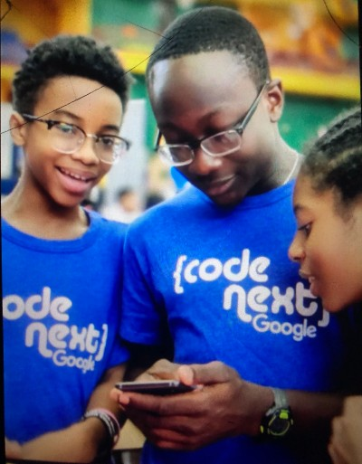
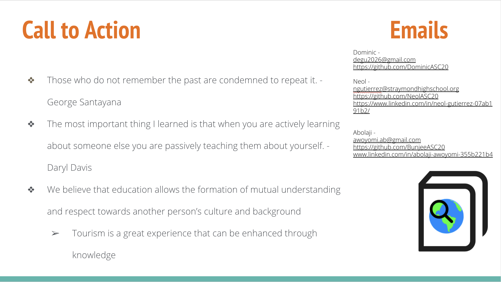

# Project 1: Design Journey

**For each milestone, complete only the sections that are labeled with that milestone.** Refine all sections before the final submission.

You are graded on your design process. If you later need to update your plan, **do not delete the original plan, leave it in place and append your new plan _below_ the original.** Then explain why you are changing your plan. Any time you update your plan, you're documenting your design process!

**Replace ALL _TODOs_ with your work.** (There should be no TODOs in the final submission.)

Be clear and concise in your writing. Bullets points are encouraged.

**Everything, including images, must be visible in _Markdown: Open Preview_.** If it's not visible in the Markdown preview, then we can't grade it. We also can't give you partial credit either. **Please make sure your design journey should is easy to read for the grader;** in Markdown preview the question _and_ answer should have a blank line between them.

## Personal Site (Milestone 1)

### Website Topic (Milestone 1)
> Briefly explain what your website will be about. Share your vision of your personal website.

My website will be showcasing me and my life. Outside of the standard 'About Me', I want to add some of my accomplishments regarding school/athletics/etc and some projects that I've worked on for fun. In other words, this could be a more casual digital porfolio/resume of sorts.

### Device (Milestone 1)
> How you will your audience likely access your website? On a laptop/desktop computer or a mobile device?
> You will design your website for mobile or desktop devices (not both).

This website will be primarily be designed for access on a computer.

## Personal Website Design Exploration (Milestone 1)

Identify three personal websites (preferably static websites) that exist today on the web. You will be drawing inspiration from these sites for your own site; please select websites that are similar to the website you wish to create.

Include a screenshot of the home page for each site. If you're planning a mobile website, your screenshots should be from a mobile website. If you're planning a desktop website, your screenshots should be from a desktop website.

**We'll refer to these are your "example websites."**

> Remove this example in your submission.
> Example: **(You may not use the instructors' websites for this part.)**

1. <https://www.jamesllewis.com/>

    

2. <https://www.midnightfern.com/a-r-t-w-o-r-k/art>

    

3. <https://www.amitworks.com/portraits>

    

### Personal Website 1 Review (Milestone 1)
> Review the personal website you identified above. (1-2 paragraphs)
>
> - Who do you think this site is designed for? Who is its intended audience?
> - What **goals** do you think the audience likely has when visiting this site.
> - What **content** is included?
> - Do you believe the content likely **addresses** the goals of the site's audience?
> - What do you like about the design?
> - Is the site designed for desktop, mobile, or desktop and mobile devices?

James' website looks like it was designed for people(teenage and up) who were interested in his background with art and hiartwork. Not only does he have a section explaining how he got into becoming an artist, he also has a shop for those looking to purchase his artwork. Some goals that the audience may have are to purchase some of his work or to learn more about his artistic process. I think that his different sections adequately represents the information for the audience to see clearly. One thing I enjoy about his design is the color scheme. His background image on the home screen blends well with the rest of the site as some of the colors in the image are used for different elements. This website looks best designed for desktop devices.

### Personal Website 2 Review (Milestone 1)
> Review the personal website you identified above. (1-2 paragraphs)
>
> - Who do you think this site is designed for? Who is its intended audience?
> - What **goals** do you think the audience likely has when visiting this site.
> - What **content** is included?
> - Do you believe the content likely **addresses** the goals of the site's audience?
> - What do you like about the design?
> - Is the site designed for desktop, mobile, or desktop and mobile devices?

The Midnight Fern website looks to be designed for buyers of paintings/photography. The goal for the audience is to see stunning images of art and potentially purchase some of the works. The creator has a navbar that shows artworl, photography, design, contact, etc. While this website itself doesn't incorporate a shop, clicking certain elements allows the user to be directed to an external shop. This website is also designed for desktop devices.

### Personal Website 3 Review (Milestone 1)
> Review the personal website you identified above. (1-2 paragraphs)
>
> - Who do you think this site is designed for? Who is its intended audience?
> - What **goals** do you think the audience likely has when visiting this site.
> - What **content** is included?
> - Do you believe the content likely **addresses** the goals of the site's audience?
> - What do you like about the design?
> - Is the site designed for desktop, mobile, or desktop and mobile devices?

Amit's website shares a similar purpose to Midnight Fern's website and looks like it is for people looking to admire amazing photographs. The audience would come to this website to se the different photos Amit has taken. Amit's navbar has everything from portraits and travel to advertising. It seems that these are the different categories for the photography she has done. I think her separation of her photos allows the audience to understand how multi-faceted her work is and how she is as a person. While the color scheme is more monotone, I think that it perhaps matches her personality and the photos she has on the home screen.

## Audience & Goals (Milestone 1)

Using what you learned from studying the example websites, identify your website's audience and their goals.

### Audience (Milestone 1)
> Briefly explain who the intended audience is for your website. Be specific and justify why this audience is appropriate for your site's topic.

My intended audience is people who want to get to know who I am that aren't opportuned to know me in real life; even for those who do know me to see more sides of me from what I make to what I have done in my life. This audience will mostly be people my age and perhaps older because those are the people I engage with most in life at this moment.

### Audience Goals (Milestone 1)
> Why would your audience visit your site?
> Identify at least 3 goals that your users have for visiting your website.

1. Look at what projects I've created

2. Understand my goals/interests in life

3. See what I have accomplished(awards/programs)

## Content Planning (Milestone 1)

Plan your site's content.

### Your Site's Planned Content (Milestone 1)
> List **all** the content you plan to include your personal website.
> You should list all types of content you planned to include (i.e. text, photos, images, etc.)

# Home

## Abolaji Oluwatimileyin Awoyomi
Welcome to my world!
    
    
    
    

# About
General Information

- I'm 18 years old, born on July 27, 2004
- I'm originally from Brooklyn, NY
- I currently reside in Huntington, NY
- My entire family is from Nigeria

<!-- Source: https://www.example.com/image.png -->

Source: <cite><a href="https://www.example.com/image.png">Example-o-Rama</a></cite>

---

Education

- Cornell University, Ithaca, NY
  - Spikeball Club, Member
  - National Society of Black Engineers, Member
  - Underrepresented Minorities in Computing, Member
  - Pursuing a B.S in Information Science
  - Expected Graduation May 2026

- Trinity School, New York, NY
  - BodyBuilding Club, President and Treasurer
  - Black Affairs Club, Member
  - Men of Color, Member
  - Jazz Messengers, Lead Bassist/Guitarist
  - Hacktrin, Outreach Coordinator
  - TrinLabs, Head of Outreach and Education
  - Peer Leader, Co-Peer Leader
  - Varsity Indoor and Outdrook Track, Captain

---

Skills and Interests

- Programming Languages: JavaScript, Python, HTML, CSS, R(Beginner), Typescript(Beginner)
- Applications: Google Workspace, Canva, iMovie, Figma
- Interests: Software Development, UI/UX Design, Social Media, Education, Creative Ideation

---

# Accomplishments

Academic Programs

- Prep for Prep, Contingent XXXVIII
  - Cum Laude, Samona Society
- Google
  - Google Code Next
  - Google CSSI
- All Star Code
  - ASC Scholar 2020
  - ASC Summer Intensive Teaching Fellow(June - August 2021)
  - ASC Weekend Intensive Teaching Assistant(February - March 2022)
  - ASC Summer Intensive Teaching Assistant(June - August 2022)

---

Jobs

- Cornell University, Ithaca, NY
  - Fitness Monitor(September 2022 - Present)
- Just Right Technology, New York, NY
  - Content Creator(March - June 2021)

---

# Portfolio

- Quoted
  - I made this to keep all the quotes that I have in my phone.
    
    
    
    

- Game Review
  - Made with Typescript, this webapp is a space for gamers to browse and review different games. I connected this to Firebase Database in order to save user data
    

- Monster Legends App
  - Monster Legends is one of my favorite mobile games. You can collect, breed, train and fight with a wide variety of monsters. In Android Studio, I used Java to sort those monsters by element and provide basic information about them. To add a fun aspect, I included a quiz to test the user on their knowledge of the game.
    
    
    

- Word Stacker
  - Word Stacker is an interactive dictionary/thesaurus. You can search words to see definition, part of speech, related words, etc or you can choose to see random words. You can save some of the words you come across to your profile and study them later.
  - I came us with this idea as a supplement to my vocabulary. I am not the strongest writer and I find myself sometimes either not knowing what word to use or using words that I do not completely understand. The programs we use in school are forced on us and feel like busy work. However, with Word Stacker, you can take control over your own education and vocabulary. I created this web app using HTML, CSS, and Javascript.
    
    
    

- Histourism
  - Histourism is a website that strategically combines history and tourism. Various people in many different communities, especially as tourists, are uninformed about the culture and history behind the places they are going to visit.
  - Our website is able to give the user information based on their desired travel location such as historical context, flight plans and more. My group and Iused HTML, CSS, and Javascript in addition to the Google Maps API and the Skyscanner Flight Search API.
    
    
    
    

---

### Content Justification (Milestone 1)
> Explain (about a paragraph) why this content is the right content for your site's audience and how the content addresses their goals.

This content aims to summarize and display parts of my life that is not so well-known. As far as my projects, providing images and descriptions allows the user to learn about what I've made over the years. In addition, the about me and accomplishments sections explain my interests and basically who I am as a person.

### Home Page Content (Milestone 1)
> What is the content that your users would expect when visiting your site for the first time.
>
> Briefly identify what content you will include on the homepage and why this content should be the first thing your target audience sees when they visit your site.

The first thing I want users to see is my full name. Most people know me by my nickname but I would like that to be front and center because not only is it very important to me and my culture, but to introduce myself as who I am.

## Information Architecture (Milestone 2)

For milestone 2, you will design the information architecture for all the pages your website.

You may change your homepage content based on your card sorting. If you do change the homepage content, don't update it above, just include the new plan in the section below (Content Organization).

### Content Organization (Milestone 2)
> Document your **iterations** of card sorting here. You must have at least 2 iterations of card sorting.
> Include photographic evidence of each iteration of card sorting **and** description of your thought process for each iteration.
> Please physically sort cards; please don't try and do this digitally.

1. First Iteration(Split Accomplishments into time period) In this iteration, I have five sections: About Me, Projects, High School, College, and Contact. The About Me section has information that is obviously 'about me'. For example, where I'm from, aspects of my heritage, what school I go to, and what I'm studying. The Projects section is as expected, a page to showcase different projects that I've created. Each project will have images, descriptions, etc. Next, we have the High School page which is meant to explore my activities/experiences during my high school career. This is a similar format to the College page, which is exactly the same but depicting college-specific activities. I split the high school and college pages because depending on the audience, they may want to focus on one of those aspects that is most apparent to them. Lastly, I have the contact page with different means of messaging me and getting in contact. I plan to have my email, linkedin, and resume on this page.

    

2. Second Iteration(Joined pages into Accomplishments). In this second iteration, I kept mostly the same sections but combined the High School and College pages into the 'Acccomplishments' page. I think that this choice makes the spread of information on my website more concise. Also, the amount of content for each of those pages was not enough to keep them as separate pages.

    

### Final Content Organization (Milestone 2)
> Which iteration of card sorting will you use for your website?

I chose the second iteration because it makes the division of information more concise and less repetitive. I think having all my accomplishments together but in chronological order is a better idea. Regarding the audience, each of these pages makes it very clear what 'parts of my life' you expect to see. If they aren't interested in who I am but more about what I've done, they will be more attracted to the 'projects' and 'accomplishments' pages.

> Explain how the final organization of content is appropriate for your site's audiences.

This final organization of content is appropriate because the different pages do not intersect. Their purposes are all different and the information shown won't be confusing between the pages. The pages are also appropriately named.

### Navigation (Milestone 2)
> Please list the pages you will include in your website's navigation.

- Home Page
- About Me
- Accomplishments
- Projects
- Contact

> Explain why the names of these pages make sense for your site's audience.

The 'Home' page is quite literally the homepage. The 'About Me' page is going to have basic information about me like where I'm from and who I am as a person. The 'Accomplishments' page will display my accomplishments in life from academics, athletics, etc. The 'Projects' page is almost a portfolio of projects that I created and that I'm proud of. Last, the 'Contact' page will have different methods of connecting and contacting with me if interested.

## Visual Themes (Milestone 3)

**Make the case for your decisions using concepts from class, as well as other design principles, theories, examples, and cases from outside of class.**

Remember to focus on the things we can't see just by looking at the site: changes, alternatives considered, processes, and justifications.

Each section is probably around 1 reasonably sized paragraph (2-4 sentences).

### Theme Ideas (Milestone 3)
> Discuss several (more than two) ideas about styling your site's theme. Explain why the theme ideas are appropriate for your target audiences.

My first idea for styling my website would be a professional look. I wouldn't use a display/handwriting font or anything too playful because it will be more geared towards potential employers or people in a professional space looking to learn about me from a professional standpoint. However, another idea I had was to make a website with a theme that represents my personality. For example, I can have smaller sections with more color and perhaps with a little less professional font to put forward that I am not one-sided. I can be playful sometimes so perhaps I can have aspects of the site that are less serious and professional while still getting my point across. In this scenario, my audience can be more widespread because I have professionalism when necessary while also showing that I'm not a square.

### Final Theme (Milestone 3)
> Which theme did you select as your final theme? Why?

I will select the 'well-rounded' theme that represents my personality. From the start of this design journey, I wasn't planning on making this website a strictly professional website because then, I would need to remove some of content that isn't applicable in that professional sense. On the other hand, I did want to showcase other parts of my 'not-professional' life that I was proud of and would love to share. This makes it more accesible to my specified target audience of **anyone** who wants to learn more about me.

### Theme Rationale (Milestone 3)
> Discuss your final theme design: how do they fit your overall design goals and audiences?

So I plan to have a fairly simple color scheme with  touches of color for certain elements. The font that I pick will be somewhat professional but have a slight display quality to it. When I start designing layout, I plan to using a lot of semantic elements for positioning like divs to section off especially for the projects page. I also will change how monotonous the lists look on the other pages.

> Emotion is a big part of design. What emotions were you thinking about or trying to convey in your designs?

I want my users to be in a good mood when they use my site. It doesn't mean happy particularly but, I want them to be interested in what they're seeing and hopefully eager to contact/connect with me.

## Layout & Composition (Final Submission)

### Home Page Layout (Final Submission)
> Include several sketches of possible layout ideas for the home page.
> Provide an explanation for each sketch explaining the idea.
> Show your design process.
> **Use the example websites above as inspiration for your site's design.**

### Final Site Design (Final Submission)
> Include a sketch of the final layout for each page in your site.
> Provide an explanation below each sketch.

### Static Website Design Check (Final Submission)
> We're building a static website without interactivity.
> **No part of your website may dynamically change.**
> Examples of dynamic behavior are dropdown menus, hamburger menus, popups, modals/lightboxes, image carousels, etc.
>dfd
> Audit your design and check that you aren't relying on any dynamic features.

All of my site's features are static without any interactivity.

## Rationale (Final Submission)

**This rationale should be polished writing:** one you might submit as a report to a client or boss to help explain the project and convince them you did a good job. You'll be surprised how much writing and communicating you need to do about projects and choices on internships and jobs; practice that here.

It should be a comprehensive, complete story of the project. You might find that each section runs a few paragraphs (1-2). Sketches can often help tell the story of your design. Screenshots are also useful for describing issues discovered during the design process and how you addressed them.

**All images must be visible in "Markdown: Open Preview" for credit!**

Your rationale should be a polished version of the earlier explanations.

### Audience (Final Submission)
> A complete and polished description of the intended audience(s) for your website.

My intended audience is for people of all ages that are interested in getting to know Abolaji Awoyomi past what is found on a first impression.

### Design Goals (Final Submission)
> An explanation of the design goals for that audience, based on your earlier rationales.

Design goals:

- Display aspects of myself in a cohesive manner
  - Using proper navigation and different pages
  - Projects are showcased to show users what I've worked on/what I'm capable of
- Allow users to follow up if interested in more

### Content Organization & Navigation (Final Submission)
> An explanation of how the final content organization and navigation met your goals and why it's appropriate for your audience.

The navigation brings the user to the section that specifically addresses the information they clicked to look for. All of my sections are in clear lists and have corresponding pictures to supplement.

### Visual Design (Final Submission)
> An explanation of how the final design met your goals and why it's appropriate for your audience.

This final design fully incorporates everything in my life that I want in the public eye. Starting on the home page, I showed an abstract timeline of how I've looked through the years. Next, my about me page shows general information, my years of education, and my skills/interests. My accomplishments page shows programs and things I've acheived that I'm proud of. My projects page also showcases my individual works that I've worked on for some time.

### Self-Reflection (Final Submission)
> Take some time here to reflect on how much you've learned since you started this class. It's often easy to ignore our own progress. Take a moment and think about your accomplishments in this class. Hopefully you'll recognize that you've accomplished a lot and that you should be very proud of those accomplishments!

- I've learned how to get around manually resizing images.
- I've also learned how to properly design before I start developingg

## Grading (Final Submission)

### Mobile or Desktop? (Final Submission)
> Should the graders, grade your site as a desktop site or a mobile site?

Desktop

### Grading: Open the Design Journey in Markdown: Open Preview (Final Submission)
> Preview your design journey in VS Code. Please verify that this document is easy to read/grade.
>
> - Remove all _TODOs_
> - All images must be visible.
> - All images must be oriented the correct way.
> - There should be a blank line between the question prompt and your answer.
>
> Is your design journey easy to read?

Yes!

### Collaborators
> List any persons you collaborated with on this project.

N/A

### Resources
> Please cite any external resources you used in the creation of your project.

N/A
